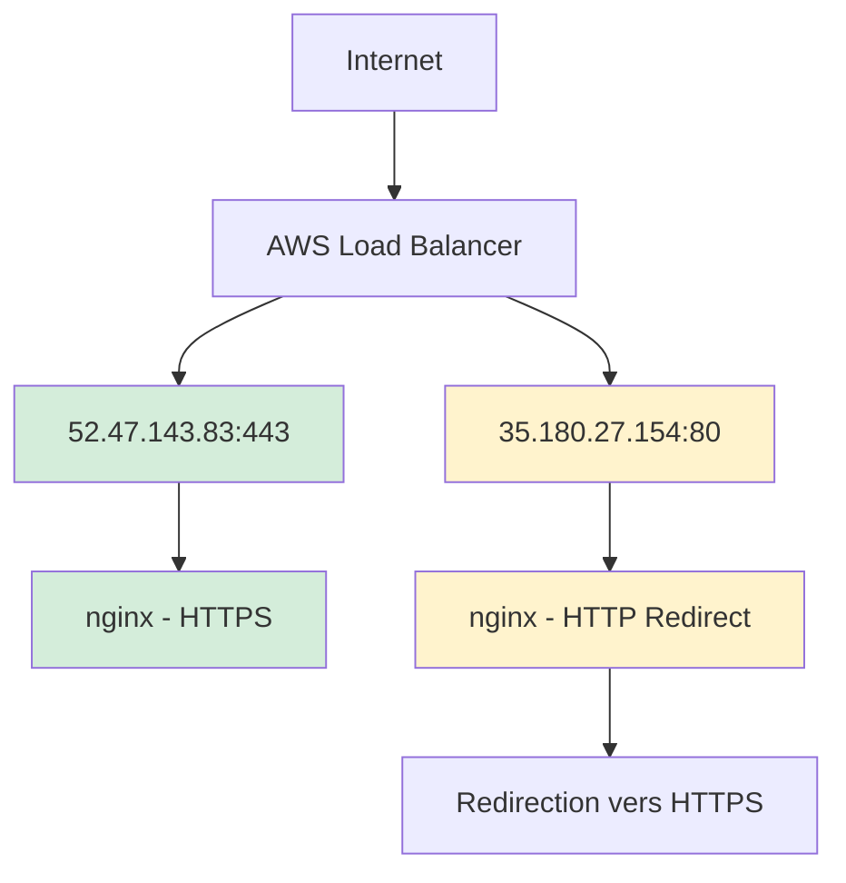

# 🔍 Rapport Shodan - Analyse "holbertonschool.com"

<div align="center">


</div>

---

## 📊 Résumé Exécutif

| **Métrique** | **Valeur** |
|--------------|------------|
| **🎯 Domaine cible** | `holbertonschool.com` |
| **📅 Date du scan** | 12 août 2025 |
| **🔢 Total de résultats** | 3 hôtes détectés |
| **🌍 Localisation principale** | AWS France (Paris) |

---

## 🚪 Ports et Services Détectés

### 📈 Répartition des Ports

```
🔒 HTTPS (443) ████████████████████████ 66.7% (2 instances)
🌐 HTTP (80)   ████████████             33.3% (1 instance)
```

| **Port** | **Service** | **Instances** | **Status** |
|----------|-------------|---------------|------------|
| **443** | HTTPS | 2 | 🟢 Actif |
| **80** | HTTP | 1 | 🔄 Redirection |

---

## 🖥️ Analyse Détaillée des Hôtes

### 🎯 **Hôte 1: Holberton School Level2 Forum**

<div style="background-color: #f6f8fa; padding: 15px; border-radius: 8px; margin: 10px 0;">

**📍 Informations Générales**
- **IP**: `52.47.143.83`
- **🌍 Localisation**: Amazon Data Services France (Paris)
- **🚪 Port**: `443 (HTTPS)`
- **⚡ Serveur**: `nginx`

**🔒 Configuration SSL**
```
✅ Certificat SSL : Valide
🏢 Autorité      : Let's Encrypt
🔐 Nom commun    : yriy2.holbertonschool.com
🎯 Valide pour   : holbertonschool.com
🛡️ Versions TLS  : TLSv1.2, TLSv1.3
```

**🛡️ En-têtes de Sécurité**
| **En-tête** | **Valeur** | **Status** |
|-------------|------------|------------|
| `X-Frame-Options` | `SAMEORIGIN` | ✅ Sécurisé |
| `X-XSS-Protection` | `0` | ⚠️ Désactivé |
| `X-Content-Type-Options` | `nosniff` | ✅ Sécurisé |
| `X-Download-Options` | `noopen` | ✅ Sécurisé |

</div>

### 🌐 **Hôte 2: Serveur de Redirection**

<div style="background-color: #fff3cd; padding: 15px; border-radius: 8px; margin: 10px 0;">

**📍 Informations Générales**
- **IP**: `35.180.27.154`
- **🌍 Localisation**: Amazon Data Services France (Paris)
- **🚪 Port**: `80 (HTTP)`
- **⚡ Serveur**: `nginx/1.18.0 (Ubuntu)`

**🔄 Comportement**
```
📊 Code HTTP     : 301 (Redirection permanente)
🎯 Destination   : holbertonschool.com
🔒 Fonction      : Force HTTPS
```

</div>

### 📚 **Hôte 3: Entrée Historique**

<div style="background-color: #e7f3ff; padding: 15px; border-radius: 8px; margin: 10px 0;">

**📍 Informations Générales**
- **IP**: `35.180.27.154` *(même que Hôte 2)*
- **📅 Détection**: 23 juillet 2025
- **🏷️ Type**: Entrée historique
- **🔄 Statut**: 301 Moved Permanently

</div>

---

## 🔐 Analyse de Sécurité

### ✅ **Points Positifs**

<div style="background-color: #d4edda; padding: 15px; border-radius: 8px; margin: 10px 0;">

- **🛡️ Chiffrement moderne**: TLS 1.2 et 1.3 supportés
- **🔒 Certificats valides**: Let's Encrypt correctement configuré
- **🔄 Redirection HTTPS**: Trafic HTTP automatiquement redirigé
- **🌍 Infrastructure AWS**: Hébergement professionnel
- **🛡️ En-têtes sécurisés**: Protection basique activée

</div>

### ⚠️ **Points d'Attention**

<div style="background-color: #fff3cd; padding: 15px; border-radius: 8px; margin: 10px 0;">

- **🚨 XSS Protection**: `X-XSS-Protection` désactivé (valeur: 0)
- **🔍 Surface d'attaque**: Limitée (seulement 2 ports actifs)

</div>

---

## 🏗️ Architecture Réseau



---

## 📋 Recommandations

### 🎯 **Priorité Haute**
1. **🛡️ Réactiver XSS Protection**: Configurer `X-XSS-Protection: 1; mode=block`

### 🎯 **Priorité Moyenne**
1. **🔒 HSTS Headers**: Ajouter `Strict-Transport-Security`
2. **🛡️ CSP Headers**: Implémenter Content Security Policy
3. **🔍 Security Headers**: Ajouter des en-têtes additionnels (Referrer-Policy, etc.)

### 🎯 **Bonnes Pratiques Actuelles**
- ✅ Configuration SSL/TLS robuste
- ✅ Redirection HTTP vers HTTPS
- ✅ Infrastructure cloud sécurisée
- ✅ Certificats SSL automatisés

---

<div align="center">

**📊 Rapport généré le**: `12 août 2025`  
**🔍 Outil d'analyse**: Shodan  
**✅ Statut**: Analyse complète

---

*Ce rapport contient les informations publiques disponibles via Shodan pour le domaine holbertonschool.com*

</div>